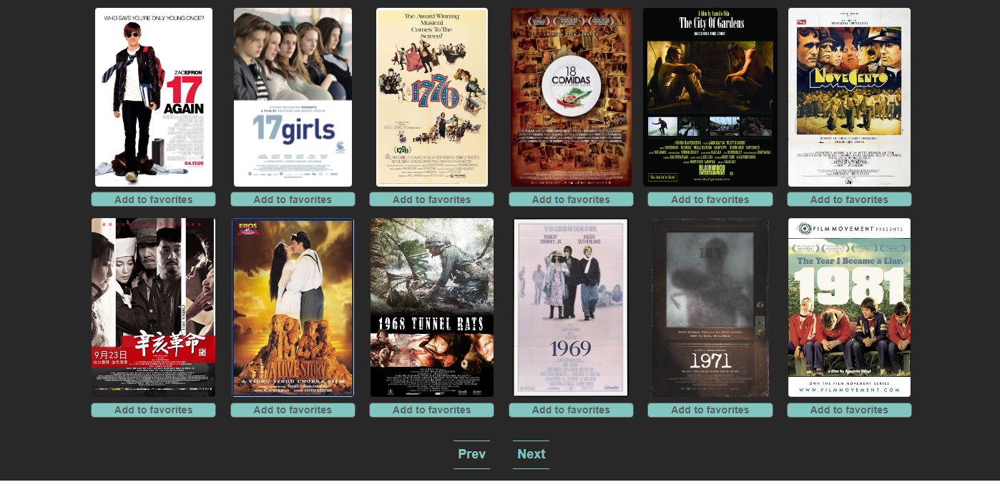

Created by a student group as part of the course IT2810 Webutvikling at NTNU in 2022.

Original GitLab repo: https://gitlab.stud.idi.ntnu.no/it2810-archive/it2810-h22/Team-61/Prosjekt3

---

# Prosjekt3


# My movie database 

My movie database  is a react (or react-native) application where you can browse hundreds of different movies (data is from https://atlas-education.s3.amazonaws.com/sampledata.archive). Graphql is used as our API. Features include search of movies, filtering of genre, pages to view more data.

## Getting started

The application consist of three parts. A MongoDB database, express backend, and a react frontend

### Instructions to set up for testing purposes

**Dependencies:**

- [ ] [MongoDB](https://www.mongodb.com/docs/manual/installation/)
- [ ] [Download MongoDB Database Tools from here](https://www.mongodb.com/try/download/shell)
- [ ] [MongoDB Database Tools Download guide ](https://www.mongodb.com/docs/database-tools/installation/installation-windows/)
- Curl

```
# Clone this repository
$ git clone https://gitlab.stud.idi.ntnu.no/tdt4140-2020/67.git
```

## Set up database
**Write in terminal**
```
mongod --config /usr/local/etc/mongod.conf
curl https://atlas-education.s3.amazonaws.com/sampledata.archive -o sampledata.archive
mongorestore --archive=sampledata.archive --db=sample_mflix --collection=movies
```

## Set up backend

```
cd backend
npm install
node server.js
```

## Set up backend

```
cd my-app
npm install
npm start
```

# Pictures

This is the main mage.


You can click on a movie to view more info.


Sort favorite movies my clicking "My favorites"


Search for favorite movies and favorite them


Click on next to view another page with more movie results, and prev to view the previous one.


